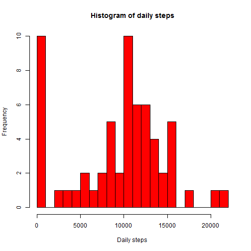
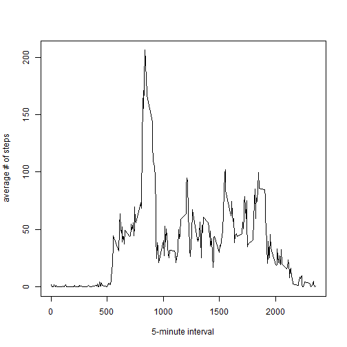
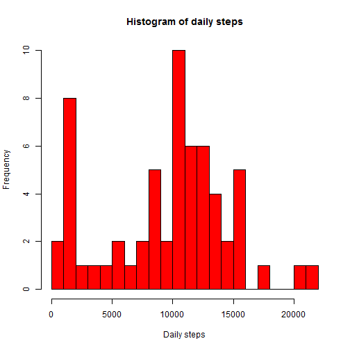
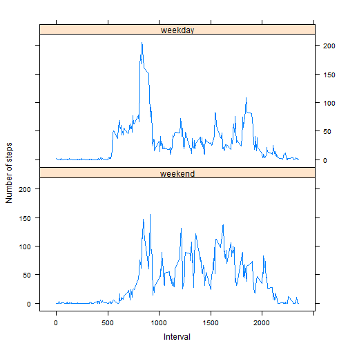

## Loading and preprocessing the data

This is the code I used to read in the data:


```r
activity <- read.csv("activity.csv")
```
This is other chunk of code used to answer to all the assignment questions:


```r
daily_steps <- aggregate(activity$steps, by=list(activity$date), FUN=sum, na.rm = TRUE)
colnames(daily_steps) <- c("date", "steps")

daily_intervals <- aggregate(activity$step, by=list(activity$interval), FUN = mean, na.rm = TRUE) 
colnames(daily_intervals) <- c("intervals", "avg_steps")

ind <- which.max(daily_intervals$avg_steps)
int_max <- daily_intervals$intervals[ind]
```

## What is mean total number of steps taken per day?

- The total number of steps taken per day is:

```r
print(daily_steps)
```

```
##          date steps
## 1  2012-10-01     0
## 2  2012-10-02   126
## 3  2012-10-03 11352
## 4  2012-10-04 12116
## 5  2012-10-05 13294
## 6  2012-10-06 15420
## 7  2012-10-07 11015
## 8  2012-10-08     0
## 9  2012-10-09 12811
## 10 2012-10-10  9900
## 11 2012-10-11 10304
## 12 2012-10-12 17382
## 13 2012-10-13 12426
## 14 2012-10-14 15098
## 15 2012-10-15 10139
## 16 2012-10-16 15084
## 17 2012-10-17 13452
## 18 2012-10-18 10056
## 19 2012-10-19 11829
## 20 2012-10-20 10395
## 21 2012-10-21  8821
## 22 2012-10-22 13460
## 23 2012-10-23  8918
## 24 2012-10-24  8355
## 25 2012-10-25  2492
## 26 2012-10-26  6778
## 27 2012-10-27 10119
## 28 2012-10-28 11458
## 29 2012-10-29  5018
## 30 2012-10-30  9819
## 31 2012-10-31 15414
## 32 2012-11-01     0
## 33 2012-11-02 10600
## 34 2012-11-03 10571
## 35 2012-11-04     0
## 36 2012-11-05 10439
## 37 2012-11-06  8334
## 38 2012-11-07 12883
## 39 2012-11-08  3219
## 40 2012-11-09     0
## 41 2012-11-10     0
## 42 2012-11-11 12608
## 43 2012-11-12 10765
## 44 2012-11-13  7336
## 45 2012-11-14     0
## 46 2012-11-15    41
## 47 2012-11-16  5441
## 48 2012-11-17 14339
## 49 2012-11-18 15110
## 50 2012-11-19  8841
## 51 2012-11-20  4472
## 52 2012-11-21 12787
## 53 2012-11-22 20427
## 54 2012-11-23 21194
## 55 2012-11-24 14478
## 56 2012-11-25 11834
## 57 2012-11-26 11162
## 58 2012-11-27 13646
## 59 2012-11-28 10183
## 60 2012-11-29  7047
## 61 2012-11-30     0
```

- Histogram of the total number of steps taken each day:


```r
hist(daily_steps$steps, xlab = "Daily steps", main = "Histogram of daily steps", 
     col = "red", breaks = 20)
```

 

- Here are the mean and median of the total number of steps taken per day:


```r
c("mean" = mean(daily_steps$steps, na.rm = TRUE), 
  "median" = median(daily_steps$steps, na.rm = TRUE))
```

```
##     mean   median 
##  9354.23 10395.00
```

## What is the average daily activity pattern?

- This is the time series plot of the 5-minute interval and the average number of steps taken, averaged across all days:


```r
plot(x = daily_intervals$intervals, y = daily_intervals$avg_steps, type = "l",
     xlab = "5-minute interval", ylab = "average # of steps")
```

 


- The maximum number of steps is obtained at the 835 5-minute interval.

## Imputing missing values

-  The total number of missing values in the dataset is:


```r
NAs <- nrow(activity) - sum(complete.cases(activity))
print(NAs)
```

```
## [1] 2304
```

- I am going to replace the NAs values in the dataset with the median value for the corresponding 5-minute interval

- This is the code to create the new dataset, which I called activity_mod:


```r
## initialize it as the activity dataframe
activity_mod <- activity
## create a dataframe with median per interval
interval_median <- 
        aggregate(activity_mod$steps, by=list(as.factor(activity_mod$interval)), 
                  FUN=median, na.rm = TRUE)
colnames(interval_median) <- c("interval", "median")

## index of NAs
ind2 <- which(is.na(activity_mod$steps))
## find the corresponding index in the interval_median dataframe
ind3 <- match(activity_mod$interval[ind2], interval_median$interval)
## replace NAs
activity_mod$steps[ind2] <-  interval_median$median[ind3]
```

- This is the histogram of the total number of steps taken each day with the new dataset:


```r
daily_steps_mod <- aggregate(activity_mod$steps, by=list(activity_mod$date),
                             FUN=sum, na.rm = TRUE)
colnames(daily_steps_mod) <- c("date", "steps")

hist(daily_steps_mod$steps, xlab = "Daily steps", 
     main = "Histogram of daily steps", col = "red", breaks = 20)
```

 

And these are the mean and the median total number of steps taken per day:


```r
c("mean" = mean(daily_steps_mod$steps, na.rm = TRUE), 
  "median" = median(daily_steps_mod$steps, na.rm = TRUE))
```

```
##      mean    median 
##  9503.869 10395.000
```

As you can see, these values differ from the first part of the assignment.  
Imputing missing data as I did lowers the mean, but not the median (as expected).

## Are there differences in activity patterns between weekdays and weekends?

1. This is the new factor I created:


```r
wdays <- c('Monday', 'Tuesday', 'Wednesday', 'Thursday', 'Friday')
activity_mod$day <- factor(weekdays(as.Date(activity_mod$date, format = "%Y-%m-%d"))
                           %in% wdays,levels=c(FALSE, TRUE), labels=c('weekend', 'weekday'))
```

2. This is the time series plot of the 5-minute interval and the average number of steps taken, averaged across all weekday days or weekend days:


```r
daily_intervals_mod <- aggregate(activity_mod$steps,
                                 by=list(activity_mod$interval,activity_mod$day),
                                 FUN = mean, na.rm = TRUE) 
colnames(daily_intervals_mod) <- c("interval", "day", "mean")

library(lattice)
xyplot(mean ~ interval| day, 
       data = daily_intervals_mod,
       type = "l",
       xlab = "Interval",
       ylab = "Number of steps",
       layout=c(1,2))
```

 

